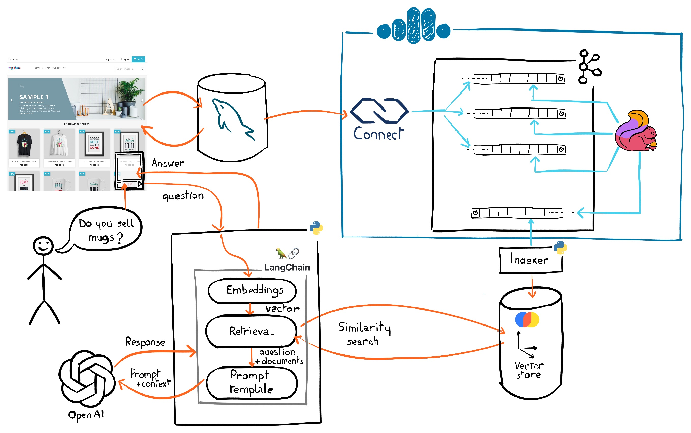

# E-commerce RAG demo

This demo showcases an example about how to build a pipeline to keep a vector DB up to date and use it to always build a prompt with fresh data from an e-commerce shop.  



This is based on a Prestashop sample that is running on top of a MySQL DB. The [MySQL CDC Source Connector](https://www.confluent.io/hub/debezium/debezium-connector-mysql) tracks changed in real time from the database.

A single [Flink](https://developer.confluent.io/courses/flink-sql/overview/) statement processes the changes coming from different tables in order to build an autonomous record. The description of the record is then translated into a vector, it's mathematical representation. Then the fully managed sink connector sends the vector to a MongoDB Atlas database.

A Flink pipeline is used to build the prompt based on a customer question, adds context based on a similarity search request applied to the vector DB and wrap the results into the prompt submitted to the OpenAI platform API.

## Run it
The provisioning process is fully automated with teh `setup_aws.sh`. 
- It creates an EC2 instance
- Installs the Docker daemon
- Sends all files 
- Start the containers: MySQL DB, Prestashop sample, the Python API that processes the customer inputs and sends replies to the browser. 
- Then it creates a [Confluent Cloud](https://confluent.cloud) from the ground with a Kafka cluster, the fully managed MySQL CDC source and MongoDB sink connectors; and a Flink pool with the statement to process the changes and the interactions with the OpenAI APIs.

The `setup_aws.sh` script requires a configuration file defined with an environment variable holding the following variables:

```shell
AWS_REGION=<region>
AWS_PROFILE=<profile>
SSH_PUB_KEY_FILE='~/.ssh/id_rsa.pub'
VM_OWNER=<value to populate the owner s tag>

MYSQL_ROOT_PASSWORD=<password>
MYSQL_PASSWORD=<password>

CONFLUENT_CLOUD_API_KEY=<key>
CONFLUENT_CLOUD_API_SECRET=<secret>
CONFLUENT_CLOUD_REGION=$AWS_REGION
CONFLUENT_CLOUD_PROVIDER=AWS

OPENAI_API_KEY=<key>

MONGODB_ATLAS_PUBLIC_KEY=<key>
MONGODB_ATLAS_PRIVATE_KEY=<password>

```
```shell 
$ CONFIG_FILE=[..]/config_aws.properties ./aws_setup.sh 
Config file: [..]/config_aws.properties
Initializing the backend...
[...]
Now you can visit the shop at http://18.201.108.106
cluster = "SASL_SSL://pkc-[...].[region].aws.confluent.cloud:9092"
sr_endpoint = "https://psrc-[...].[region].aws.confluent.cloud"
urls = <<EOT
Shop: 			http://18.21.108.106
Backend:  		http://18.21.108.106/admin2 (demo@prestashop.com/prestashop_demo)

EOT
```

Now you can browse to the shop application, click on the chat button in the bottom right corner and ask questions about the products for sale on the shop! 


⚠️ Don't forget that you will be charged for the provisioned resources, so as soon as you no longer need the demo, think about disposing everything, and the `teardown_aws.sh` script is here to destroy everything.

